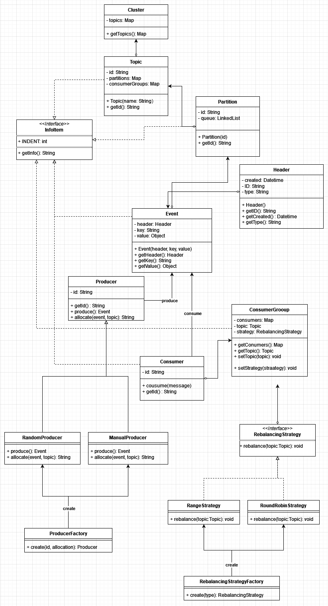

# Final Design Solution for Tributary System

## Final Testing Plan and Usability Tests

### Final Testing Plan

The final testing plan of the system:

- **Unit Tests**: Cover individual components such as event, partition, and consumer group.
- **Integration Tests**: Ensure components interact correctly.
- **System Tests**: Simulate real-world usage to evaluate the system's behavior under various scenarios.

### Usability Tests

The final list of usability tests includes:

1. **Topic Management Tests**: Verify the creation, listing, and deletion of topics.
2. **Partition Assignment Tests**: Confirm correct assignment and rebalancing of partitions.
3. **Producer Functionality Tests**: Test event production with both random and manual allocation.
4. **Consumer Interaction Tests**: Validate event consumption and offset management.
5. **Replay Capability Tests**: Ensure accurate replay of events from specified offsets.
6. **Concurrency Tests**: Check the system's stability under concurrent operations.
7. **CLI Interaction Tests**: Ensure the command-line interface supports all required operations.

## Overview of Design Patterns Used

The solution use several design patterns to enhance modularity, flexibility, and maintainability:

- **Factory Pattern**: Used in `ProducerFactory` for creating instances of producers based on allocation strategy.
- **Strategy Pattern**: Use rebalancing strategies in `RebalancingStrategy` to allow dynamic changes.
- **Singleton Pattern**: Used in `TributarySystem` to ensure a single instance manages the entire event system.
- **Template Method Pattern**: Found in abstract classes like `Consumer` and `Producer`, defining skeleton methods.
- **Composite Pattern**: `InfoItem` could serve as a component interface, with `Topic`, `Partition`, `Consumer`, and `ConsumerGroup` being composites or leaf nodes.

## Accommodation of Design Considerations

### Concurrency

To address concurrency, we implemented synchronized methods and blocks to ensure thread safety. This approach prevents race conditions and ensures data consistency.

### Generics

We used Java generics extensively to allow flexibility in event payload types. This ensures that any object type can be used within the system while maintaining type safety.

### API Design

The API was designed to be intuitive and well-documented with JavaDoc. It provides a clear separation between the public API and internal components, adhering to the principles of encapsulation and abstraction.
## Final UML Diagram

## Reflection on the Assignment

The development of the event-driven system posed several challenges, particularly in designing a flexible yet robust API. I initially faced difficulties in setup the system's architecture but found clarity through iterative design and refactoring.

My chosen component-driven approach proved beneficial for collaborative development and maintaining a cohesive design. However, it required careful planning and coordination to ensure all components integrated seamlessly.

Throughout the project, I learned the importance of thorough testing and the value of design patterns in creating a system. I encountered some unexpected complexities, particularly with concurrency issues, which led us to refine my approach and deepen my understanding of Java's concurrency mechanisms.

### Video Demonstration

For a detailed demonstration of running the system, please watch the following video:

[Running the Tributary System](https://www.youtube.com/watch?v=dAnxC4Wb41w)