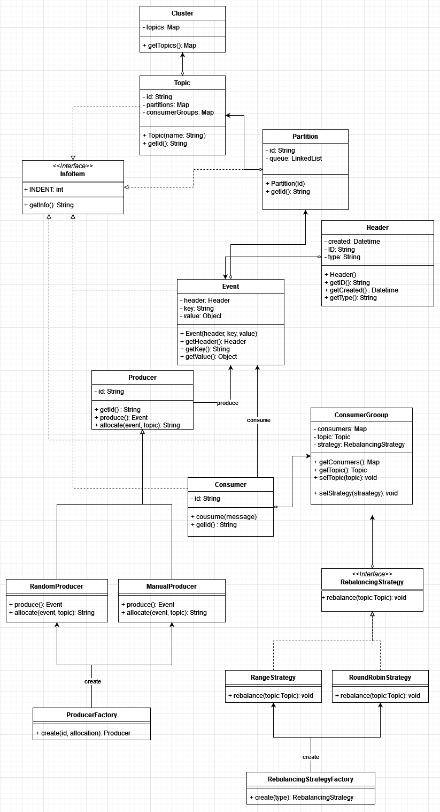

# 支流系统最终设计方案

## 最终测试计划与可用性测试

### 最终测试计划

系统的最终测试计划包括：

- **单元测试**：覆盖各个独立组件，如事件、分区和消费者组。
- **集成测试**：确保各组件之间的交互正确。
- **系统测试**：模拟实际使用情况，评估系统在不同场景下的表现。

### 可用性测试

最终的可用性测试清单包括：

1. **主题管理测试**：验证主题的创建、列出和删除功能。
2. **分区分配测试**：确认分区的正确分配和再平衡。
3. **生产者功能测试**：测试事件生产，包括随机分配和手动分配。
4. **消费者交互测试**：验证事件消费和偏移量管理。
5. **重放能力测试**：确保从指定偏移量准确重放事件。
6. **并发测试**：检查系统在并发操作下的稳定性。
7. **命令行交互测试**：确保命令行界面支持所有必需的操作。

## 设计模式概述

该解决方案使用了几种设计模式，以提高模块化、灵活性和可维护性：

- **工厂模式**：在 `ProducerFactory` 中用于根据分配策略创建生产者实例。
- **策略模式**：在 `RebalancingStrategy` 中使用重平衡策略，允许动态更改。
- **单例模式**：在 `TributarySystem` 中使用，确保一个实例管理整个事件系统。
- **模板方法模式**：在抽象类如 `Consumer` 和 `Producer` 中使用，定义骨架方法。
- **组合模式**：`InfoItem` 可以作为组件接口，`Topic`、`Partition`、`Consumer` 和 `ConsumerGroup` 是组合或叶子节点。

## 设计考虑因素的处理

### 并发性

为了处理并发性，我们实现了同步方法和代码块，以确保线程安全。这种方法可以防止竞态条件，并确保数据一致性。

### 泛型

我们广泛使用了 Java 泛型，以允许事件负载类型的灵活性。这样可以确保系统中使用的任何对象类型都能保持类型安全。

### API 设计

API 的设计注重直观性和良好的文档化，采用了 JavaDoc。它提供了公共 API 与内部组件之间的清晰分离，遵循封装和抽象的原则。

## 最终 UML 图

## 对任务的反思

开发事件驱动系统时面临了几个挑战，特别是在设计一个灵活且稳健的 API 时。起初在搭建系统架构时遇到困难，但通过迭代设计和重构，我逐渐理清了思路。

我选择的基于组件的方法证明对协作开发和保持设计一致性非常有益。然而，这需要精心的规划和协调，确保所有组件能无缝集成。

在整个项目过程中，我深刻体会到全面测试的重要性，以及设计模式在创建系统中的价值。我还遇到了一些意外的复杂问题，特别是并发问题，这促使我改进了我的方法，并深入理解了 Java 并发机制。

### 视频演示

要观看详细的系统运行演示，请点击以下视频链接：

[运行支流系统](https://www.youtube.com/watch?v=dAnxC4Wb41w)
