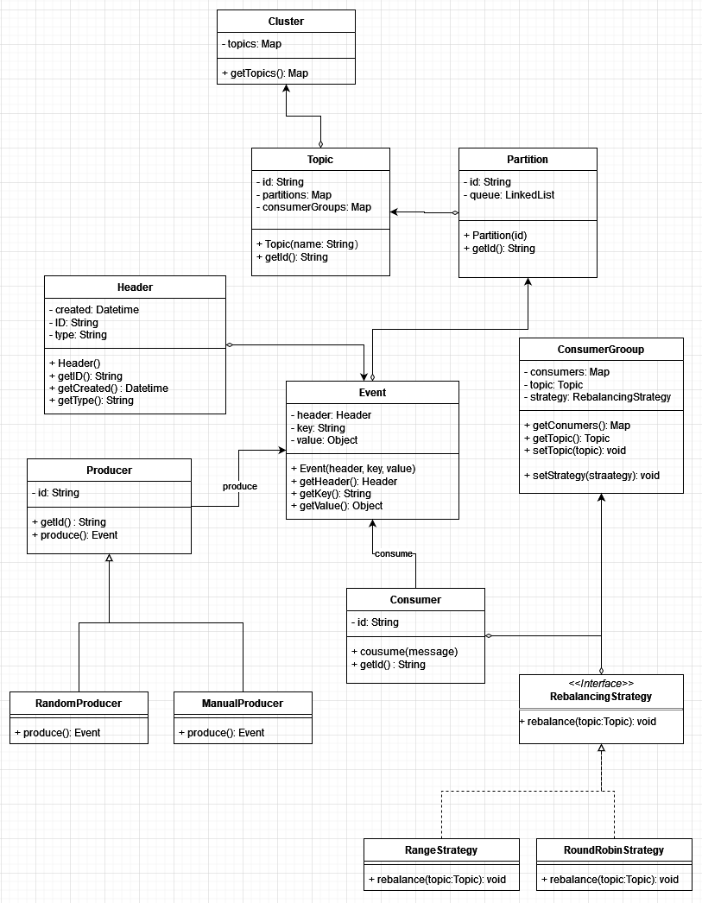

# Preliminary Design

## Analysis of Engineering Requirements

The engineering requirements focus on the core components of an event-driven architecture: producers, consumers, topics, partitions, and the message lifecycle. Key considerations include:

- **Message Lifecycle**: Understanding how messages are created, assigned to partitions, and consumed.
- **Producers and Consumers**: Distinguishing between random and manual message allocation for producers, and the role of consumers within consumer groups.
- **Partition Management**: How partitions are created, managed, and rebalanced among consumers.
- **Concurrency**: Ensuring thread safety and correct operation in a multi-threaded environment.
- **Generics**: Allowing flexibility in the type of event payloads.

## Usability Tests Checklist

To verify system functionality, we will develop a set of usability tests that cover various scenarios:

1. **Topic Management**: Create, list, and delete topics.
2. **Partition Management**: Create, assign, and rebalance partitions within a topic.
3. **Consumer Group Management**: Create, modify, and delete consumer groups and their rebalancing strategies.
4. **Producer Operations**: Create producers with random/manual allocation and produce events.
5. **Consumer Operations**: Consume events from assigned partitions and handle message offset management.
6. **Event Replay**: Test the replay functionality from specific offsets.

## Initial UML Diagram

## Java API Design

The Java API will be designed with the following:

### API Components

- **Topic**: Interface for topic management.
- **Cluter**:Contains a series of topics.
- **Partition**: Class for managing partition queues.
- **Producer**: Interface for producing events, with implementations for RandomProducer and ManualProducer.
- **Consumer**: Interface for consuming events, with a concrete Consumer class.
- **ConsumerGroup**: Class for managing a group of consumers and their rebalancing strategies.

### Core Package

- Internal classes that support the API but are not exposed to the end-user.

## Testing Plan

The testing plan will include:

- **Unit Tests**: For individual components.
- **Integration Tests**: For testing the interaction between components (e.g., producer-consumer interaction, rebalancing logic).
- **Usability Tests**: Incorporating the checklist to ensure the CLI meets the user requirements.

## Implementation Approach

We will adopt a **Component-driven** approach for the following reasons:

1. **Task Division**:
    - Easier to divide tasks.
    - Each component can be developed independently.

2. **Early Issue Detection**:
    - Early detection of issues through unit testing.
    - Leads to fewer integration problems later, improving overall system stability.